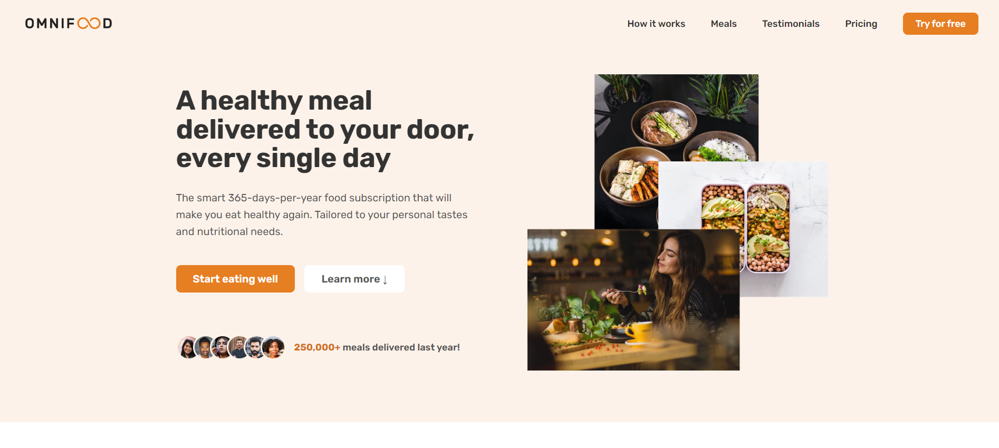

# Omnifood - AI-Powered Meal Planning and Delivery

## What the Project Does

Omnifood is a revolutionary app that combines technology with a focus on consumer well-being through a healthy diet. In a world where people are often overwhelmed with busy schedules, juggling work, family, and social activities, finding time for cooking can be a challenge. Omnifood aims to address this issue with an AI-centric approach. Users can use the app to select their dietary preferences, favorite foods, and foods to avoid. The AI algorithm then creates a personalized weekly meal plan. Taking it a step further, Omnifood partners with restaurants and cooking partners to prepare and deliver all meals from the generated plans to users in selected cities. This innovative service is offered through a convenient monthly subscription, allowing users to receive one or two meals per day, every day of the month.

## Why the Project is Useful

Omnifood provides a comprehensive solution to the challenges of maintaining a healthy diet in a busy world:

- **AI-Powered Meal Planning:** Users can effortlessly create personalized weekly meal plans based on their preferences.
- **Healthy Diet Focus:** The app emphasizes the importance of consumer well-being by promoting a balanced and healthy diet.
- **Convenient Meal Delivery:** Omnifood collaborates with restaurants to prepare and deliver meals, ensuring users receive high-quality and nutritious food without the hassle of cooking.
- **Flexible Subscription:** Users can choose between receiving one or two meals per day, making it adaptable to their lifestyle.

## How Users Can Get Started with the Project

To get started with Omnifood, follow these steps:

1. Download and install the Omnifood app on your mobile device.
2. Sign up and create a user profile.
3. Customize your dietary preferences, favorite foods, and foods to avoid.
4. Choose your subscription plan, indicating whether you want one or two meals per day.
5. Enjoy the convenience of personalized, healthy meals delivered to your doorstep.

## Where Users Can Get Help with the Project

If you encounter any issues or have questions about the Omnifood app, feel free to reach out for assistance. You can contact the support team within the app or connect with the project maintainer, Hamilton Conford, via email at [hamiltonconford@gmail.com](mailto:hamiltonconford@gmail.com). Additionally, you may find helpful resources in the app's documentation or seek assistance on the app's platform.

## Who Maintains and Contributes to the Project

Omnifood is developed and maintained by Hamilton Conford, a senior developer based in Nairobi, Kenya, with a primary focus on consumer well-being through innovative solutions. For inquiries, collaboration opportunities, or further information, please contact Hamilton Conford.
